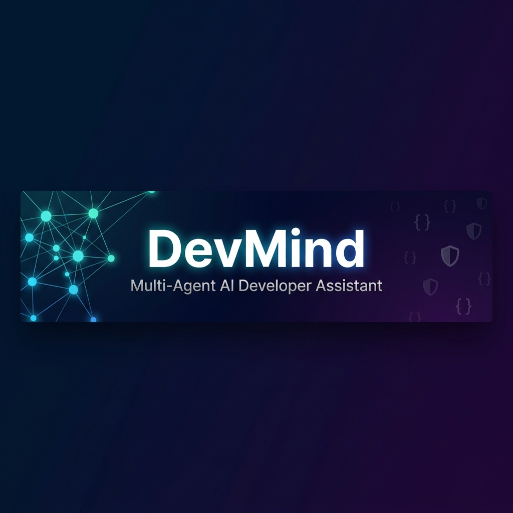
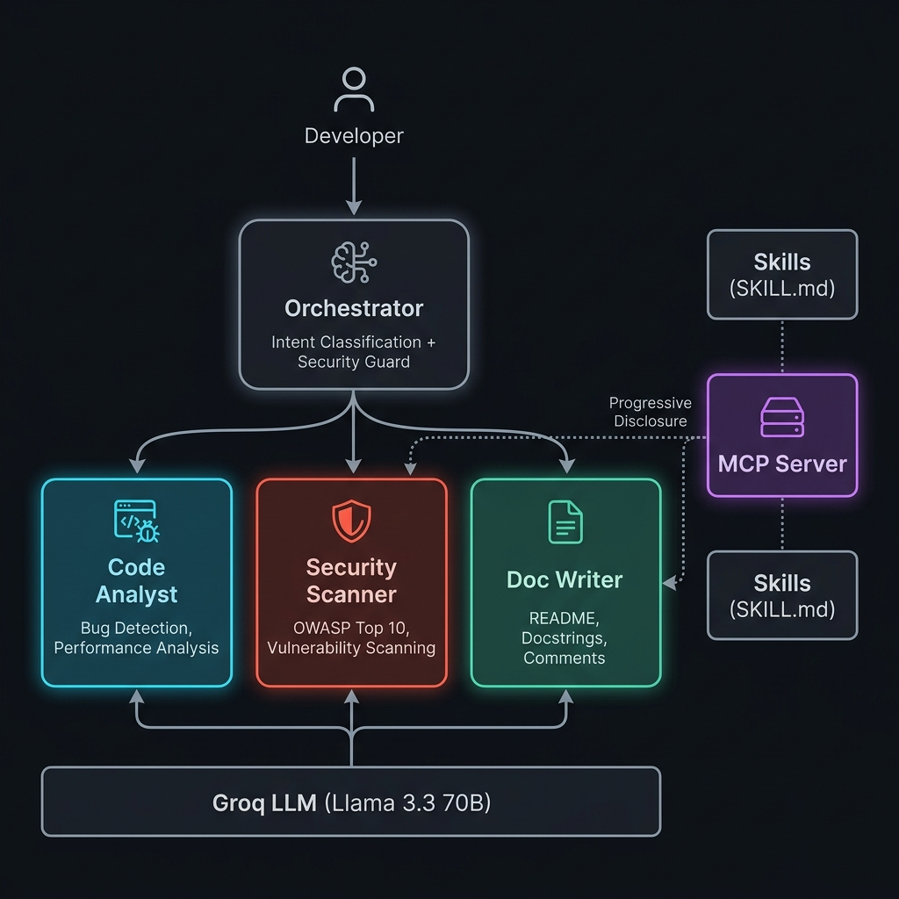

<p align="center">
  
</p>

<p align="center">
  <strong>Multi-Agent AI Developer Assistant</strong><br/>
  <em>Intelligently routes developer requests to specialized AI agents for code review, security analysis, and documentation generation.</em>
</p>

<p align="center">
  
  
  
  
  
  
</p>

<p align="center">
  <a href="#-features">Features</a> •
  <a href="#-architecture">Architecture</a> •
  <a href="#-quick-start">Quick Start</a> •
  <a href="#-demo">Demo</a> •
  <a href="#-project-structure">Project Structure</a> •
  <a href="#-how-it-works">How It Works</a> •
  <a href="#-concepts-demonstrated">Concepts</a> •
  <a href="#-contributing">Contributing</a>
</p>

---

## 🧠 What is DevMind?

Developers frequently switch between multiple tools for reviewing code, writing documentation, and identifying security vulnerabilities. **DevMind** eliminates this friction by combining these capabilities into a unified multi-agent system.

Instead of relying on a single, general-purpose AI assistant, DevMind uses an **intelligent orchestrator** that:

1. **Classifies** the developer's intent from natural language input
2. **Guards** against dangerous or malicious inputs via a security layer
3. **Routes** the request to the most specialized agent
4. **Injects** domain-specific skill context via an MCP server
5. **Returns** expert-level responses powered by Llama 3.3 70B on Groq

> **Built for the [Kaggle AI Agents Intensive Capstone 2025](https://www.kaggle.com/competitions/ai-agents-intensive-capstone-2025)**

---

## ✨ Features

<table>
<tr>
<td width="50%">

### 🤖 Multi-Agent Architecture
Three specialized agents, each with domain-specific system prompts and behavior, orchestrated by an intent classifier.

### 🔀 Automatic Task Routing
Keyword-based intent classification routes requests to the right agent — no manual selection needed.

### 🛡️ Security Guardrails
Regex-based input filtering blocks dangerous patterns like `rm -rf`, `eval()`, `exec()`, `os.system()`, and `__import__`.

</td>
<td width="50%">

### 📡 MCP Server Integration
A Model Context Protocol server provides progressive skill disclosure — agents receive domain context only when needed.

### 📋 Audit Logging
Every interaction is logged with agent attribution and input tracking for full traceability.

### ⚡ Groq-Powered Inference
Ultra-fast LLM inference via Groq API running Llama 3.3 70B for production-grade responses.

</td>
</tr>
</table>

---

## 🏗️ Architecture

<p align="center">
  
</p>

### Data Flow

```
Developer Input
       │
       ▼
┌──────────────────┐
│  Security Guard   │ ◄── Blocks dangerous patterns (rm -rf, eval, exec, etc.)
└────────┬─────────┘
         │ (safe input)
         ▼
┌──────────────────┐
│   Orchestrator    │ ◄── Intent classification via keyword matching
└────────┬─────────┘
         │
    ┌────┼────────────┐
    │    │             │
    ▼    ▼             ▼
┌──────┐ ┌──────────┐ ┌──────────┐
│ Code │ │ Security │ │   Doc    │
│Analyst│ │ Scanner  │ │  Writer  │
└──┬───┘ └────┬─────┘ └────┬─────┘
   │          │             │
   └──────────┼─────────────┘
              │
              ▼
    ┌──────────────────┐
    │ MCP Server       │ ◄── Loads SKILL.md context per agent
    │ (Skill Context)  │
    └────────┬─────────┘
             │
             ▼
    ┌──────────────────┐
    │ Groq API         │
    │ Llama 3.3 70B    │ ◄── Fast inference endpoint
    └──────────────────┘
```

---

## 🚀 Quick Start

### Prerequisites

- Python 3.9+
- A free [Groq API Key](https://console.groq.com/)

### Installation

```bash
# Clone the repository
git clone https://github.com/Raghuvansyn/DevMind.git
cd DevMind

# Create and activate virtual environment
python -m venv venv
source venv/bin/activate  # On Windows: venv\Scripts\activate

# Install dependencies
pip install -r requirements.txt

# Configure environment
cp .env.example .env
# Edit .env and add your Groq API key
```

### Usage

```bash
python orchestrator.py
```

You'll see the interactive prompt:

```
DevMind ready. Type 'exit' to quit, 'log' to see audit trail.
============================================================

You: _
```

---

## 🎬 Demo

### 📺 Video Demo

<p align="center">
  <a href="https://youtu.be/-DHTtXIJ8g8">
    
  </a>
</p>

### 💬 Sample Interactions

<details>
<summary><strong>🔍 Code Review</strong></summary>

```
You: review this function for bugs

DevMind:
[ORCHESTRATOR] Routing to: code_analyst

[Code Analyst]
Issue: Division by Zero
Explanation: The function does not validate the divisor before performing division.
Fix:
  Before: result = a / b
  After:  if b == 0: raise ValueError("Divisor cannot be zero")
          result = a / b
```

</details>

<details>
<summary><strong>🛡️ Security Scan</strong></summary>

```
You: scan this code for SQL injection vulnerabilities

DevMind:
[ORCHESTRATOR] Routing to: security_scan

[Security Scanner | Scan #1]
RISK LEVEL: HIGH
VULNERABILITY: SQL Injection
DESCRIPTION: User input is directly concatenated into SQL query string.
RECOMMENDATION: Use parameterized queries.
  Before: query = f"SELECT * FROM users WHERE id = {user_input}"
  After:  cursor.execute("SELECT * FROM users WHERE id = %s", (user_input,))
```

</details>

<details>
<summary><strong>📝 Documentation</strong></summary>

```
You: write a README for a Python web scraper project

DevMind:
[ORCHESTRATOR] Routing to: doc_writer

[Doc Writer]
# Web Scraper

## Overview
A Python-based web scraper for extracting structured data from websites.

## Installation
pip install -r requirements.txt

## Usage
python scraper.py --url https://example.com --output data.json
...
```

</details>

<details>
<summary><strong>🚫 Security Guard (Blocked Input)</strong></summary>

```
You: run rm -rf / on my system

DevMind:
[SECURITY] Blocked dangerous input.
[BLOCKED] Input flagged by security guard.
```

</details>

---

## 📁 Project Structure

```
DevMind/
│
├── 📄 orchestrator.py          # Main entry point — orchestrator + security guard + routing
│
├── 📂 agents/
│   ├── __init__.py
│   ├── base_agent.py           # Base class — Groq API integration & LLM calls
│   ├── code_analyst.py         # Code review agent — bugs, performance, anti-patterns
│   ├── security_scan.py        # Security agent — OWASP Top 10, vulnerability detection
│   └── doc_writer.py           # Documentation agent — README, docstrings, comments
│
├── 📂 skills/
│   ├── code_analyst/
│   │   └── SKILL.md            # Skill context for code analysis
│   ├── security_scan/
│   │   └── SKILL.md            # Skill context for security scanning
│   └── doc_writer/
│       └── SKILL.md            # Skill context for documentation
│
├── 📂 mcp/
│   ├── __init__.py
│   └── mcp_server.py           # MCP server — skill loading, file reading, security
│
├── 📂 assets/
│   ├── banner.png              # Repository banner image
│   └── architecture.png        # Architecture diagram
│
├── 📄 requirements.txt         # Python dependencies
├── 📄 .env.example             # Environment variable template
├── 📄 .gitignore               # Git ignore rules
├── 📄 KAGGLE_WRITEUP.md        # Kaggle capstone writeup
├── 📄 LICENSE                  # MIT License
└── 📄 README.md                # You are here
```

---

## ⚙️ How It Works

### 1. Security Guard
Before any processing, all input passes through a regex-based security filter that blocks dangerous patterns:

```python
BLOCKED = [r"(rm\s+-rf|sudo|eval\s*\(|exec\s*\(|__import__|os\.system)"]
```

### 2. Intent Classification
The orchestrator classifies intent using keyword matching:

| Keywords | Routed To |
|---|---|
| `security`, `vulnerability`, `scan`, `injection`, `exploit`, `safe` | 🛡️ Security Scanner |
| `document`, `readme`, `docstring`, `comment`, `docs` | 📝 Doc Writer |
| *(everything else)* | 🔍 Code Analyst |

### 3. MCP Server & Progressive Disclosure
Each agent has a corresponding `SKILL.md` file that defines its capabilities. The MCP server loads these on-demand and injects them into the agent's system prompt, giving it domain-specific context without bloating the base prompt.

### 4. Agent Execution
Each agent extends `BaseAgent`, which handles:
- System prompt construction with skill context injection
- Groq API communication (Llama 3.3 70B, temperature 0.3)
- Error handling and response formatting

### 5. Audit Logging
Every interaction is recorded in-memory with the agent name and input text, accessible via the `log` command.

---

## 📚 Concepts Demonstrated

| Concept | Implementation |
|---|---|
| **Multi-Agent Orchestration** | Orchestrator dispatches to specialized agents based on intent |
| **Intent Classification** | Keyword-based routing determines the best agent for each request |
| **Tool Routing** | Automatic selection of the right tool (agent) for the job |
| **MCP Server** | Model Context Protocol server for skill management and file access |
| **Progressive Disclosure** | SKILL.md files provide context only when an agent is activated |
| **Agent Specialization** | Each agent has a focused system prompt and domain expertise |
| **Security Guardrails** | Regex-based input filtering blocks dangerous patterns |
| **Audit Logging** | Full interaction history with agent attribution |
| **Zero-Trust Security Design** | Security scanner uses ephemeral context — no state between scans |

---

## 🛠️ Tech Stack

| Technology | Purpose |
|---|---|
| **Python 3.9+** | Core language |
| **Llama 3.3 70B** | Large language model for agent intelligence |
| **Groq API** | Ultra-fast LLM inference endpoint |
| **MCP (Model Context Protocol)** | Skill context management and progressive disclosure |
| **SKILL.md** | Declarative skill definitions for each agent |
| **Requests** | HTTP client for API communication |
| **python-dotenv** | Environment variable management |

---

## 🔮 Future Improvements

- [ ] 🌐 Web dashboard with real-time agent visualization
- [ ] 🎤 Voice interface for hands-free coding assistance
- [ ] 🔗 GitHub integration for automated PR reviews
- [ ] 🧠 Memory & RAG for context-aware multi-turn conversations
- [ ] 🐳 Docker deployment with one-command setup
- [ ] ☁️ Cloud deployment (AWS / GCP / Azure)
- [ ] 📊 Agent performance analytics and metrics
- [ ] 🔌 Plugin system for custom agents

---

## 🤝 Contributing

Contributions are welcome! Feel free to:

1. Fork the repository
2. Create a feature branch (`git checkout -b feature/amazing-feature`)
3. Commit your changes (`git commit -m 'Add amazing feature'`)
4. Push to the branch (`git push origin feature/amazing-feature`)
5. Open a Pull Request

---

## 📄 License

This project is licensed under the MIT License — see the [LICENSE](LICENSE) file for details.

---

## 🙏 Acknowledgments

- **[Kaggle](https://www.kaggle.com/)** — AI Agents Intensive Capstone 2025
- **[Groq](https://groq.com/)** — Ultra-fast LLM inference
- **[Meta](https://ai.meta.com/)** — Llama 3.3 70B model

---

<p align="center">
  <strong>⭐ If you found this useful, please star the repository!</strong><br/><br/>
  <a href="https://github.com/Raghuvansyn/DevMind">
    
  </a>
</p>
